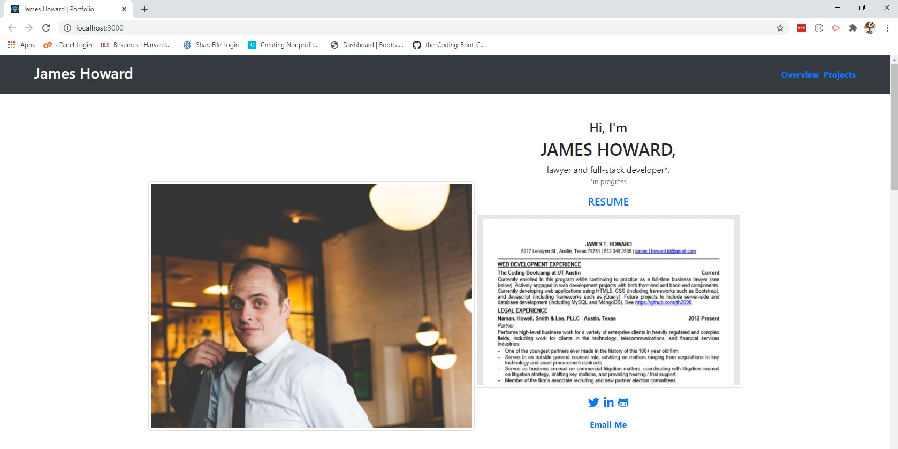

# React Portfolio

[Deployed Portfolio](https://jth2698.github.io/react-portfolio)

## Overview

This is a React refactor of my portfolio page. Most of the variable data including project details have been moved into individual .json files in the `data` subdirectory, with the content being renders through use of React `props`. The page has also been broken into multiple React `components` to make managing and updating my portfolio easier.

I also took this opportunity to incorporate `flexbox` into my portfolio instead of using the traditional Bootstrap grid system.

## Notes

* I recognize that my resume needs to be updated to focus more on web development and the various skills I have learned in the bootcamp.
* I have not yet updated my resume because I am not sure what path I want to take in web development. I am still exploring potential legal paths within the web development / technology field.
* My goal is to complete the class and to then do a final update of my portfolio with a new resume and with the last project added.